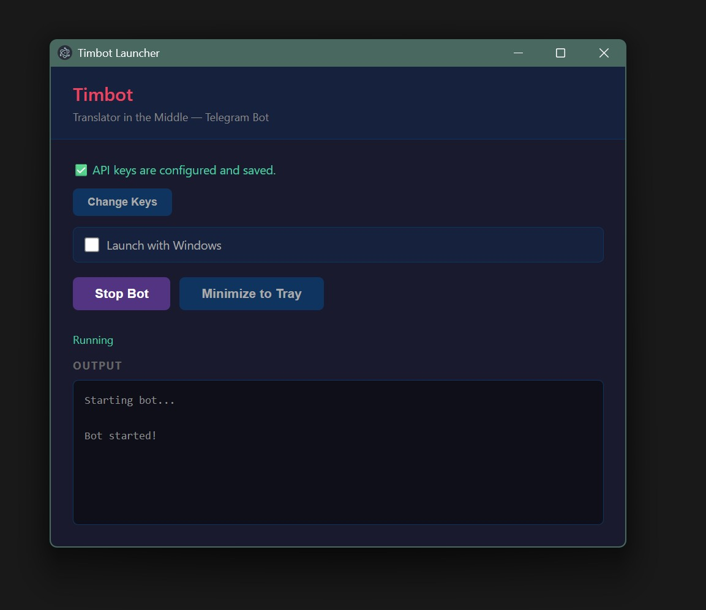

# Translator in the Middle Bot

A Telegram bot that enables real-time translation between two users speaking different languages.

## Demo

[Watch demo video](https://youtu.be/ixND90dAXlM)

[t.me/tinthem_bot](https://t.me/tinthem_bot)

## Desktop Launcher

[](https://github.com/sebseb7/timbot/releases/download/v1.0.0/Timbot.Setup.1.0.0.exe)

[Download Timbot Setup 1.0.0](https://github.com/sebseb7/timbot/releases/download/v1.0.0/Timbot.Setup.1.0.0.exe)

## Features

- `/new` - Create a new conversation and get a shareable code
- `/join <code>` - Join an existing conversation
- `/leave` - Leave your current conversation
- `/lang <code>` - Set your preferred language (default: English)
- `/output <mode>` - Set voice output mode: `text` (transcribed) or `audio` (translated speech)

When in an active conversation, all messages are automatically translated to your partner's language using OpenAI.

## Setup

1. Install dependencies:
```bash
npm install
```

2. Copy `.env.example` to `.env` and fill in your credentials:
```bash
cp .env.example .env
```

3. Get a Telegram bot token from [@BotFather](https://t.me/botfather)

4. Get an OpenAI API key from [OpenAI](https://platform.openai.com)

5. Run the bot:
```bash
npm start
# or with auto-reload during development:
npm run dev
```

## Supported Languages

`af`, `ar`, `hy`, `az`, `be`, `bs`, `bg`, `ca`, `zh`, `hr`, `cs`, `da`, `nl`, `en`, `et`, `fi`, `fr`, `gl`, `de`, `el`, `he`, `hi`, `hu`, `is`, `id`, `it`, `ja`, `kn`, `kk`, `ko`, `lv`, `lt`, `mk`, `ms`, `mr`, `mi`, `ne`, `no`, `fa`, `pl`, `pt`, `ro`, `ru`, `sr`, `sk`, `sl`, `es`, `sw`, `sv`, `tl`, `ta`, `th`, `tr`, `uk`, `ur`, `vi`, `cy`

## How to Use

1. Start the bot with `/start`
2. Set your language with `/lang <code>` (e.g., `/lang es` for Spanish)
3. Create a conversation with `/new` and share the code with a friend
4. Your friend joins with `/join <code>`
5. Chat! Messages will be automatically translated.

## Database

The bot uses Better SQLite3 for data storage. The database file is created at `./data/bot.db`.
